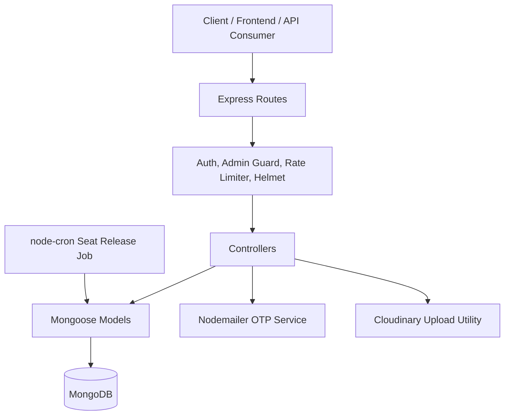
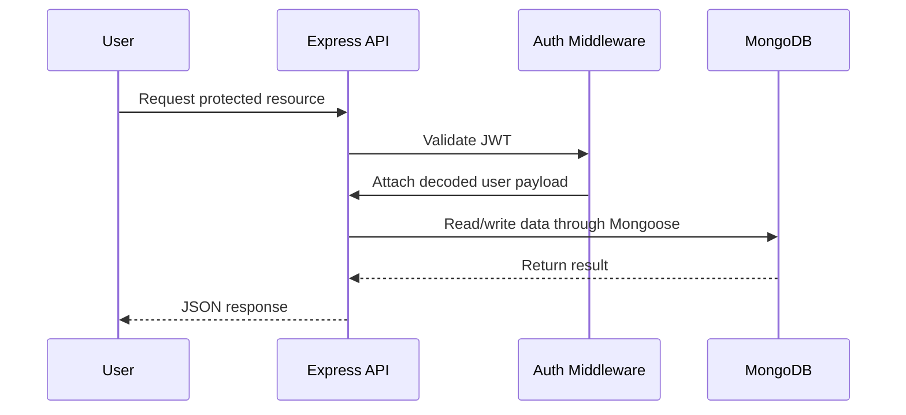
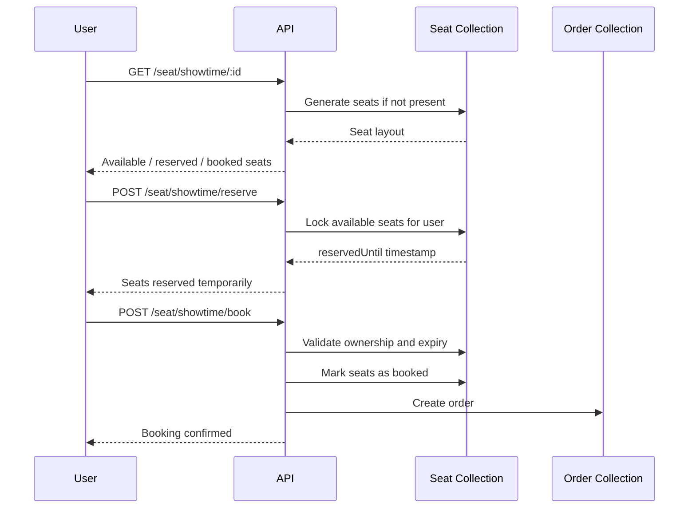
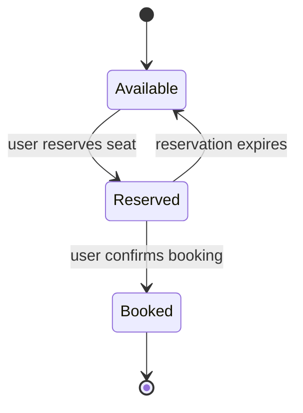
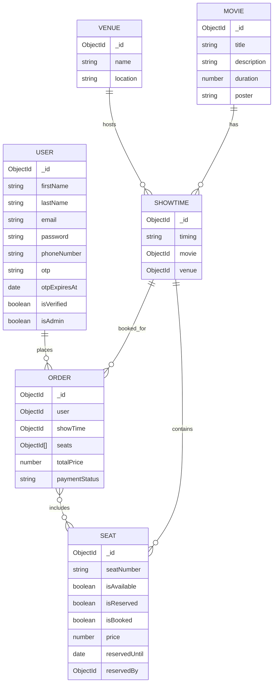

# BookMyShow-Style Ticket Booking API


A production-minded backend API for a movie ticket booking platform inspired by BookMyShow. The system supports user onboarding with OTP verification, JWT-based authentication, admin-driven movie and venue management, showtime scheduling, real-time-style seat reservation, atomic seat booking, order creation, request rate limiting, and Docker-based deployment.

This project is designed to demonstrate backend engineering fundamentals expected in scalable marketplace and booking systems: secure authentication, concurrency-aware seat locking, clean REST APIs, MongoDB data modeling, middleware-driven architecture, and testable Express application structure.

---

## Table of Contents

- [Overview](#overview)
- [Key Features](#key-features)
- [Tech Stack](#tech-stack)
- [Architecture](#architecture)
- [Project Structure](#project-structure)
- [Getting Started](#getting-started)
- [Environment Variables](#environment-variables)
- [API Reference](#api-reference)
- [Booking Flow](#booking-flow)
- [Data Model](#data-model)
- [Testing](#testing)
- [Docker](#docker)
- [Security & Reliability](#security--reliability)
- [Production Improvements](#production-improvements)
- [License](#license)

---

## Overview

The API models the core backend workflow of a cinema ticket booking platform:

1. Users request an OTP and complete signup.
2. Users authenticate with email and password.
3. Admins create movies, venues, and showtimes.
4. Users view movies, venues, showtimes, and seat layouts.
5. Users reserve seats for a limited time window.
6. Users confirm reserved seats and generate an order.
7. Expired reserved seats are automatically released by a scheduled cleanup job.

The backend is implemented as a modular Express application using route, controller, middleware, model, utility, and configuration layers.

---

## Key Features

### Authentication & User Management

- OTP-based signup flow using email delivery.
- Password hashing with `bcrypt`.
- JWT authentication with support for bearer token, cookie token, or request-body token.
- Role-based access control for admin-only operations.
- HTTP-only cookie support for authenticated sessions.

### Movie, Venue & Showtime Management

- Create and list movies.
- Search movies by title, description, and duration.
- Sort and paginate movie results.
- Create and list venues.
- Link movies with venues.
- Add multiple showtimes to a venue for a movie.
- Populate related movie, venue, and showtime data using Mongoose references.

### Seat Reservation & Booking

- Auto-generates seats for a showtime when the layout is first requested.
- Supports seat states: available, reserved, and booked.
- Temporarily reserves seats for a fixed lock window.
- Prevents booking of seats reserved by another user.
- Validates reservation ownership and expiry before booking.
- Uses MongoDB sessions and transactions during booking.
- Creates an order after successful booking.
- Automatically releases expired reservations with a scheduled cron job.

### API Quality & Operations

- Global request rate limiting.
- Separate stricter limiter for auth-sensitive routes.
- `helmet` middleware for security-related HTTP headers.
- Request logging with `morgan`.
- Response latency tracking through `X-Response-Time` headers.
- Dockerfile for containerized deployment.
- Jest + Supertest testing setup with MongoDB Memory Server.

---

## Tech Stack

| Layer | Technology |
| --- | --- |
| Runtime | Node.js 18+ |
| Framework | Express.js 5 |
| Database | MongoDB |
| ODM | Mongoose |
| Authentication | JWT, bcrypt, cookies |
| Email / OTP | Nodemailer, otp-generator |
| File / Image Utility | Cloudinary |
| Security | Helmet, express-rate-limit |
| Logging | Morgan, custom latency middleware |
| Scheduling | node-cron |
| Testing | Jest, Supertest, MongoDB Memory Server |
| Deployment | Docker |

---

## Architecture



### Request Lifecycle



---

## Project Structure

```text
BookmyShow/
├── Controllers/
│   ├── Movie.js
│   ├── Order.js
│   ├── Seat.js
│   ├── User.js
│   └── Venue.js
├── Middleware/
│   ├── Auth.js
│   ├── globalLimiter.js
│   └── rateLimiter.js
├── Models/
│   ├── Movie.js
│   ├── Order.js
│   ├── Seat.js
│   ├── ShowTime.js
│   ├── User.js
│   └── Venue.js
├── Route/
│   ├── Seat.js
│   ├── movie.js
│   ├── order.js
│   ├── user.js
│   └── venue.js
├── Utility/
│   ├── Utility.js
│   ├── mailSender.js
│   └── releaseExpiredSeats.js
├── config/
│   ├── cloudinary.js
│   └── database.js
├── tests/
│   ├── jest.setup.js
│   ├── movie.getAllMovie.test.js
│   └── setupTestDB.js
├── app.js
├── index.js
├── Dockerfile
├── jest.config.js
├── package.json
└── package-lock.json
```

---

## Getting Started

### Prerequisites

Make sure you have the following installed:

- Node.js 18 or later
- npm
- MongoDB Atlas account or a local MongoDB instance
- Cloudinary account, if image upload functionality is enabled
- SMTP credentials for OTP email delivery

### Installation

```bash
git clone <your-repository-url>
cd BookmyShow
npm install
```

### Configure Environment

Create a `.env` file in the project root:

```bash
cp .env.example .env
```

Then fill in the required values listed in [Environment Variables](#environment-variables).

### Run the Application

```bash
npm run dev
```

For production-style execution:

```bash
npm start
```

By default, the server uses:

```text
http://localhost:4000
```

Health check:

```http
GET /
```

Expected response:

```json
{
  "success": true,
  "message": "Your server is up and running...."
}
```

---

## Environment Variables

Create a `.env` file with the following variables:

```env
PORT=4000
MONGODB_URL=your_mongodb_connection_string
JWT_SECRET=your_secure_jwt_secret

MAIL_HOST=your_smtp_host
MAIL_USER=your_smtp_username
MAIL_PASS=your_smtp_password

CLOUD_NAME=your_cloudinary_cloud_name
API_KEY=your_cloudinary_api_key
API_SECRET=your_cloudinary_api_secret
```

> Never commit `.env` files, database credentials, JWT secrets, email credentials, or Cloudinary secrets to GitHub.

---

## API Reference

### Authentication Header

Protected routes accept a JWT token using one of the following methods:

```http
Authorization: Bearer <jwt_token>
```

or an HTTP-only cookie named:

```text
token
```

---

### User APIs

| Method | Endpoint | Access | Description |
| --- | --- | --- | --- |
| `POST` | `/user/sendOtp` | Public | Sends a signup OTP to the user email. |
| `POST` | `/user/signup` | Public | Registers and verifies a user using OTP. |
| `POST` | `/user/login` | Public intended | Authenticates a verified user and returns a JWT. |

#### Send OTP

```http
POST /user/sendOtp
Content-Type: application/json
```

```json
{
  "email": "user@example.com"
}
```

#### Signup

```http
POST /user/signup
Content-Type: application/json
```

```json
{
  "firstName": "Alex",
  "lastName": "Carter",
  "email": "alex@example.com",
  "password": "StrongPassword123",
  "phoneNumber": "9999999999",
  "otp": "123456"
}
```

#### Login

```http
POST /user/login
Content-Type: application/json
```

```json
{
  "email": "alex@example.com",
  "password": "StrongPassword123"
}
```

---

### Movie APIs

| Method | Endpoint | Access | Description |
| --- | --- | --- | --- |
| `GET` | `/movie/getAllMovie` | Public | Lists movies with pagination, filtering, and sorting. |
| `GET` | `/movie/:id` | Public | Gets a movie by ID with populated venues and showtimes. |
| `GET` | `/movie/venue/:id` | Public | Gets venues and showtimes for a movie. |
| `POST` | `/movie/createMovie` | Admin | Creates a new movie. |
| `POST` | `/movie/:movieId/addVenues` | Admin | Links venues to a movie. |

#### List Movies

```http
GET /movie/getAllMovie?limit=5&offset=0&name=avatar&sort=asc
```

Supported query parameters:

| Parameter | Type | Description |
| --- | --- | --- |
| `limit` | Number | Number of movies to return. |
| `offset` | Number | Number of records to skip. |
| `name` | String | Case-insensitive movie title search. |
| `description` | String | Case-insensitive description search. |
| `duration` | Number | Exact duration filter. |
| `sort` | `asc` / `desc` | Sorts by movie title. |

#### Create Movie

```http
POST /movie/createMovie
Authorization: Bearer <admin_token>
Content-Type: application/json
```

```json
{
  "title": "Interstellar",
  "description": "A science-fiction epic about time, gravity, and survival.",
  "duration": 2.49,
  "poster": "https://example.com/poster.jpg"
}
```

#### Add Venues to Movie

```http
POST /movie/:movieId/addVenues
Authorization: Bearer <admin_token>
Content-Type: application/json
```

```json
{
  "venueIds": ["venueObjectId1", "venueObjectId2"]
}
```

---

### Venue APIs

| Method | Endpoint | Access | Description |
| --- | --- | --- | --- |
| `GET` | `/venue/getAllVenue` | Public | Lists venues with pagination. |
| `GET` | `/venue/:id` | Public | Gets venue details with associated movies. |
| `POST` | `/venue/createVenue` | Admin | Creates a new venue. |
| `POST` | `/venue/:id/timing/add` | Admin | Adds showtimes for a movie at a venue. |

#### Create Venue

```http
POST /venue/createVenue
Authorization: Bearer <admin_token>
Content-Type: application/json
```

```json
{
  "name": "PVR Phoenix Mall",
  "location": "Lucknow, India"
}
```

#### Add Showtimes

```http
POST /venue/:id/timing/add
Authorization: Bearer <admin_token>
Content-Type: application/json
```

```json
{
  "movieId": "movieObjectId",
  "showTimings": ["10:30", "14:00", "19:30"]
}
```

---

### Seat APIs

| Method | Endpoint | Access | Description |
| --- | --- | --- | --- |
| `GET` | `/seat/showtime/:id` | Public | Gets or initializes the seat layout for a showtime. |
| `POST` | `/seat/showtime/reserve` | Authenticated | Temporarily reserves selected seats. |
| `POST` | `/seat/showtime/book` | Authenticated | Books previously reserved seats and creates an order. |

#### Get Seat Layout

```http
GET /seat/showtime/:id
```

#### Reserve Seats

```http
POST /seat/showtime/reserve
Authorization: Bearer <jwt_token>
Content-Type: application/json
```

```json
{
  "showTime": "showTimeObjectId",
  "SeatIDs": ["seatObjectId1", "seatObjectId2"]
}
```

#### Book Seats

```http
POST /seat/showtime/book
Authorization: Bearer <jwt_token>
Content-Type: application/json
```

```json
{
  "showTime": "showTimeObjectId",
  "SeatIDs": ["seatObjectId1", "seatObjectId2"]
}
```

---

### Order APIs

| Method | Endpoint | Access | Description |
| --- | --- | --- | --- |
| `GET` | `/order/getOrders` | Authenticated | Fetches the authenticated user's booking orders. |

```http
GET /order/getOrders
Authorization: Bearer <jwt_token>
```

---

## Booking Flow



### Seat State Machine



---

## Data Model



---

## Testing

The project includes a Jest and Supertest setup with MongoDB Memory Server for isolated API testing.

Run tests:

```bash
npm test
```

Watch mode:

```bash
npm run test:watch
```

Current test coverage includes:

- `GET /movie/getAllMovie`
- In-memory MongoDB database setup and teardown
- Supertest-based Express API request testing

> Note: On some machines or CI environments, MongoDB Memory Server may take longer than Jest's default 5-second hook timeout while downloading or starting the MongoDB binary. If that happens, increase Jest's timeout or preconfigure the MongoDB Memory Server binary cache.

---

## Docker

Build the Docker image:

```bash
docker build -t bookmyshow-api .
```

Run the container:

```bash
docker run -p 4000:4000 --env-file .env bookmyshow-api
```

The Dockerfile uses:

```dockerfile
FROM node:18-alpine
```

---

## Security & Reliability

Implemented safeguards:

- Password hashing with `bcrypt`.
- JWT-based authentication.
- Admin-only route protection.
- HTTP-only authentication cookie support.
- Request rate limiting for global and auth-specific traffic.
- Security headers through `helmet`.
- Request payload size limit in the testable app instance.
- Time-limited seat reservations.
- Cron-based release of expired reserved seats.
- Booking transaction flow to reduce race-condition risk.

Recommended production hardening:

- Remove debug logs that print emails, passwords, OTPs, tokens, or JWT secret metadata.
- Use strong input validation with libraries such as Zod, Joi, or express-validator.
- Add centralized error handling middleware.
- Add refresh-token flow or short-lived access tokens.
- Store secrets in a managed secret vault.
- Replace in-memory cache with Redis for multi-instance deployments.
- Use a MongoDB replica set or MongoDB Atlas for transaction support.
- Add API documentation through OpenAPI / Swagger.
- Add structured logging and monitoring.

---

## Production Improvements

Before using this as a production service, the following improvements are recommended:

- Make `/user/login` publicly accessible by removing authentication middleware from the login route.
- Fix the order lookup query to use the schema field `user` instead of `userId`.
- Make global rate limits configurable through environment variables.
- Add indexes for high-read fields such as `movie.title`, `showTime`, `reservedUntil`, and `email`.
- Add request validation for all route bodies and params.
- Add pagination through query parameters consistently across venue and movie APIs.
- Add payment gateway integration for real payment confirmation.
- Add CI workflow for linting and automated tests.
- Add Docker Compose for local MongoDB-based development.

---

## Why This Project Matters

This backend demonstrates core engineering skills that are directly relevant to real-world remote backend roles:

- Designing modular REST APIs.
- Modeling relational workflows in MongoDB.
- Handling authentication and authorization.
- Managing temporary inventory locks.
- Thinking about concurrency and race conditions.
- Writing testable Express applications.
- Preparing services for containerized deployment.

---

## License

This project is licensed under the ISC License.

---

## Author

Built as a backend engineering portfolio project.

